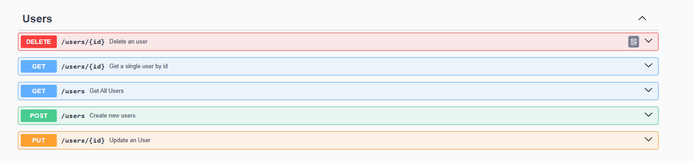

# Demo OpenApi

A simple project written in Spring Boot to show how to use springdoc to generate
the Swagger UI. The data is persisted using SQLite.



Demo OpenAPI backend only has one single resource: User, as shown in the image above.

We can encounter the code for the User CRUD in the [user folder](./src/main/java/com/raul/demoopenapi/users) with the following folders:

* _Models_. For DTOs.
* _Persistence_. Entity Models and Repositories.
* _Validators_. For logic to validate inputs.
* _Service_. For the services that will user the Repositories and validators. They will
           bear the logic of the application.
* _Mappers_. Classes that will be used to convert from an object to another.
* _Controller_. Here we define the endpoints and use the services.


## Deployment of the OpenAPI web app

In our [application.yml file](./src/main/resources/application.yml) we can define some properties that will set up the correct URLs for the OpenAPI Swagger

```yml
springdoc:
  swagger-ui:
    path: /api/swagger-ui.html
    operationsSorter: method
    enabled: true
  api-docs.path: /api/docs
  packagesToScan: com.raul.demoopenapi
  pathsToMatch: /**
```
The three most important fields for the deployment are:
- springdoc.swagger.ui.path
- springdoc.swagger-ui.enabled
- springdoc.api-docs.path

You can write the desired endpoints for the Swagger UI path and the API doc paths. Futhermore,
the field enabled must be set to true. If not, the Swagger UI won't be shown.


### Exposing the Spring Boot app behind a Reverse Proxy

If the backend is going to be exposed behind a Reverse proxy, some more configurations will be needed. We can start
with the Headers Filters configuration in the SpringBoot Application class. A initial configuration can be this one:

```java
   @Bean
   ForwardedHeaderFilter forwardedHeaderFilter() {
      return new ForwardedHeaderFilter();
   }
```

But, of course, we need to add some headers within the reverse proxy. In this case I will show the Nginx configuration for doing this:

```nginx
location /YOUR_LOCATION/ {

    # These two fields are mandatory
    
    proxy_pass http://YOUR_IP_MAYBE_LOCALHOST:PORT/;
    proxy_set_header X-Forwarded-Prefix "/YOUR_LOCATION";
    
    # This is only needed if you are using HTTPS.
    # With this configuration, the Swagger UI will use HTTPS for the endpoints

    proxy_set_header X-Forwarded-Proto https;
    proxy_set_header X-Forwarded-Port 443;
  }
```